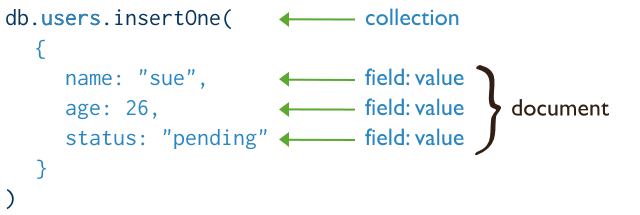

# MongoDB CRUD操作 #
## 本章介绍 ##
> * Create Operations(创建操作)
> * Read Operations(读操作)
> * Update Operations(更新操作)
> * Delete Operations(删除操作)
> * Bulk Write(批量写操作)

CRUD代表着创建，读取，更新和删除文档。
## Create Operations(创建操作) ##
>创建或插入操作将新文档添加到集合中。如果集合当前不存在，则插入操作将创建集合。
>MongoDB提供以下方法将文档插入到集合中： 
>db.collection.insertOne() --3.2版本或以上可以用 
>db.collection.insertMany() --3.2版本或以上可以用

在MongoDB中，插入操作指向单个集合。 MongoDB中的所有写入操作都是基于单个文档的级别的。如图:

insertMany()可以参考MondoDB.md中的简介，用法也很简单。 
所有插入文档方法预览: 
>db.collection.insertOne() 将单个文档插入到集合中。 
>db.collection.insertMany() 将多个文档插入到集合中。 
>db.collection.insert() 将单个文档或多个文档插入到集合中。 
### 插入的附加方法 ###
以下方法也可以将新文档添加到集合中：

* db.collection.update() upsert参数: true.
* db.collection.updateOne() upsert参数: true.
* db.collection.updateMany() upsert参数: true.
* db.collection.findAndModify() upsert参数: true.
* db.collection.findOneAndUpdate() upsert参数: true.
* db.collection.findOneAndReplace() upsert参数: true.
* db.collection.save().
* db.collection.bulkWrite().
具体各自的语法可参考[https://docs.mongodb.com/manual/reference/method/js-collection/](https://docs.mongodb.com/manual/reference/method/js-collection/)
## Read Operations(读操作) ##
读取操作从集合中检索文档;即查询文档的集合。 MongoDB提供了从集合中读取文档的以下方法：
> * db.collection.find()

您可以指定查询过滤器或标识要返回的文档的条件。如图:

## Update Operations(更新操作) ##
>更新操作修改集合中的现有文档。 MongoDB提供以下更新集合文档的方法： 
>db.collection.updateOne() --3.2版本或以上可以用 
>db.collection.updateMany() --3.2版本或以上可以用 
>db.collection.replaceOne() --3.2版本或以上可以用 

在MongoDB中，更新操作定位到单个集合。 MongoDB中的所有写入操作都是基于单个文档的级别的。
## Delete Operations(删除操作) ##
>删除操作从集合中删除文档。 MongoDB提供以下方法来删除集合的文档：
>您可以指定标识要删除的文档的条件或过滤器。这些过滤器使用与读取操作相同的语法。

## Bulk Write(批量写操作) ##
MongoDB提供批量执行写入操作的功能。有关详细信息，请参阅批量写操作。

----------
以上为常用的CRUD操作，更多常用的API可以参考:
[https://docs.mongodb.com/manual/reference/method/js-collection/](https://docs.mongodb.com/manual/reference/method/js-collection/ "MongoDB各种常用API")

 

