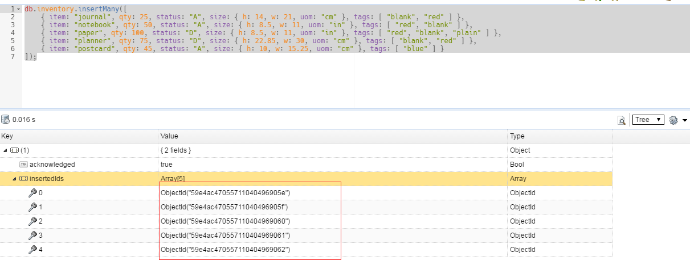
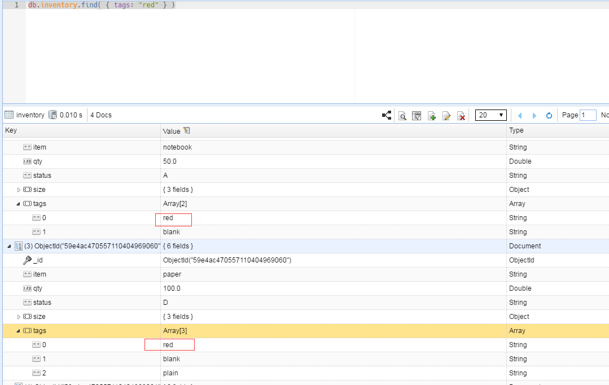

# MongoDB 简介 #

### 本页面对以下知识简介 ###
> * [文档型数据库](https://docs.mongodb.com/manual/introduction/#document-database "https://docs.mongodb.com/manual/introduction/#document-database")
> * [主要特性](https://docs.mongodb.com/manual/introduction/#key-features "https://docs.mongodb.com/manual/introduction/#key-features")

MongoDB是一个开源的文档数据库，可提供高性能，高可用性和自动缩放等特性。

## 文档型数据库 ##
> MongoDB中的一个记录是一个文档，它是一个由字段和值对组成的数据结构。MongoDB的文档类似于JSON对象。其字段的值可能包括其他文档，数组和文档数组。

> ### 使用文档记录的优点有: ###
 * 文档（即对象）对应于许多编程语言中的本机数据类型。
 * 嵌入式文档和数组减少了昂贵的连接的需要。
 * 动态模式支持流畅的多态(不同于关系型数据库，字段模式固定)。

## 主要特性 ##
### 高性能 ###
MongoDB提供高性能数据持久性。尤其是：
> * 支持嵌入式数据模型可减少数据库系统上的I / O活动。
> * 索引支持更快的查询，并且可以包括来自嵌入文档和数组的键。
### 丰富的查询语言 ###
MongoDB支持丰富的查询语言来支持读写操作（CRUD）以及：
> * 数据汇总(聚合)。
> * 文本搜索和地理空间查询。
### 高可用性 ###
MongoDB的复制工具，称为副本集，提供：
> * 自动故障转移。
> * 数据冗余。

复制集是一组MongoDB服务器，它们保持相同的数据集，提供冗余和增加数据可用性。
### 水平可扩展性 ###
MongoDB提供了可扩展性，作为其核心功能的一部分：
> * 分片通过一组机器分发数据。
> * MongoDB 3.4支持基于分片键创建数据区域。在平衡的集群中，MongoDB将区域覆盖的读写操作仅指向区域内的分片。有关详细信息，请参阅“区域”手册页。
### 支持多存储引擎 ###
MongoDB支持多种存储引擎，如：
> * WiredTiger存储引擎
> * MMAPv1存储引擎

此外，MongoDB还提供可插拔的存储引擎API，允许第三方为MongoDB开发存储引擎。

----------
# 入门 #
## MongoDB Atlasl ##
> MongoDB Atlas是一个云托管服务，用于配置，运行，监控和维护MongoDB部署。 MongoDB是一种快速，简单，自由的方式。要在本地安装和运行MongoDB，请参阅安装MongoDB。**本教程使用本地按照的MongoDB作为例子**

## Mongo Shell ##
以下教程使用mongo shell连接到本地的MongoDB，插入数据和执行查询操作。

## 文档和集合 ##
MongoDB将数据存储为集合中的BSON文档（JSON的二进制表示）。 MongoDB数据库包含文档集合。

## 插入文档 ##
db.collectionName.insertMany()可以将多个文档插入到集合中，可以将一系列文档传递给该方法。如往集合inventory中添加多个文档记录，使用下面语句:   
<blockquote>
db.inventory.insertMany([   
   { item: "journal", qty: 25, status: "A",
       size: { h: 14, w: 21, uom: "cm" }, tags: [ "blank", "red" ] },
   { item: "notebook", qty: 50, status: "A",
       size: { h: 8.5, w: 11, uom: "in" }, tags: [ "red", "blank" ] },
   { item: "paper", qty: 100, status: "D",
       size: { h: 8.5, w: 11, uom: "in" }, tags: [ "red", "blank", "plain" ] },
   { item: "planner", qty: 75, status: "D",
       size: { h: 22.85, w: 30, uom: "cm" }, tags: [ "blank", "red" ] },
   { item: "postcard", qty: 45, status: "A",
       size: { h: 10, w: 15.25, uom: "cm" }, tags: [ "blue" ] }
]);
</blockquote>
insertMany()返回包含新插入的文档_id字段值的文档。如图:

使用db.collectionName.insertOne（）插入单个文档。

有关更多信息和示例，请参阅在CRUD部分插入文档。

## 查询文档 ##
### 查询所有文档 ###
要选择集合中的所有文档，请将空文档作为查询过滤器文档传递给db.collectionName.find（）方法，如：
> `db.inventory.find( {} )`

要查询符合特定相等条件的文档，请向find（）方法传递给所需文档的<field>：<value>的查询过滤器文档。以下示例从库存集中选择状态等于“D”的所有文档：
> `db.inventory.find( { status: "D" } )`

### 匹配嵌入文档 ###
整个嵌入式文档中的等式匹配需要精确匹配指定的`<value>`文档，包括字段顺序。例如，以下查询选择字段大小等于文档的所有文档`{ h: 14, w: 21, uom: "cm" }:`
> `db.inventory.find( { size: { h: 14, w: 21, uom: "cm" } } )`

### 匹配嵌入文档中的字段 ###
以下示例选择所有文档，其中uom嵌套在size字段中的字段等于字符串值“in”：
> `db.inventory.find( { "size.uom": "in" } )`

### 匹配数组中的元素 ###
以下示例查询所有文档，其中tag是包含字符串“red”作为其元素之一的数组：
> `db.inventory.find( { tags: "red" } )`
> 结果如图:
> 

## 完全匹配数组 ###
以下示例查询所有文档，其中字段tags值是具有指定顺序的正好两个元素“红色”和“空白”的数组：
> `db.inventory.find( { tags: ["red", "blank"] } )`

有关更多信息和查询示例，请参阅CRUD部分中的查询文档。 

要更新或删除文档，请参阅更新文档和删除文档。

----------
# 数据库和集合 #
MongoDB在文档中存储BSON文档，即数据记录;数据库中的集合，一个集合(collection)中包含多个记录文档。

## Databases(数据库) ##
在MongoDB中，数据库包含文档集合。一个数据库中包含许多集合，一个集合中又包含多个文档记录。
要选择要使用的数据库，请在mongo shell中发出使用`<db>`语句，如以下示例所示：
> `use myDB`

## Create a Database(创建数据库) ##
如果数据库不存在，MongoDB将在首次存储该数据库的数据时创建数据库。因此，您可以切换到不存在的数据库，并在mongo shell中执行以下操作：
> `use myNewDB` `db.myNewCollection1.insertOne( { x: 1 } )`

insertOne（）操作将会创建数据库myNewDB和集合myNewCollection1，如果他们都不存在的话。

有关数据库名称的限制列表，请参阅命名限制。

## Collections(集合) ##
MongoDB将文档存储在集合中。集合类似于关系数据库中的表。
### Create a Collection(创建集合) ###
> 如果一个集合不存在，MongoDB将在首次存储该集合的数据时创建集合。
> db.myNewCollection2.insertOne( { x: 1 } )
>  
> db.myNewCollection3.createIndex( { y: 1 } )
>  
> insertOne（）和createIndex（）操作都会创建它们各自的集合，如果他们都不存在。

### Explicit Creation(明确地创建) ###
>MongoDB提供db.createCollection（）方法来显式创建具有各种选项的集合，例如设置最大大小或文档验证规则。如果您没有指定这些选项，则不需要显式创建集合，因为当您首次存储集合的数据时，MongoDB将创建新集合。

### Document Validation(文档验证) ###
>(MongoDB3.2或以上版本才有的特性)
>默认情况下，集合不需要其文档具有相同的模式;即单个集合中的文档不需要具有相同的字段集合，并且字段的数据类型可以在集合内的文档之间不同。
>然而，从MongoDB 3.2开始，您可以在更新和插入操作期间对集合执行文档验证规则。有关详细信息，请参阅文档验证。

